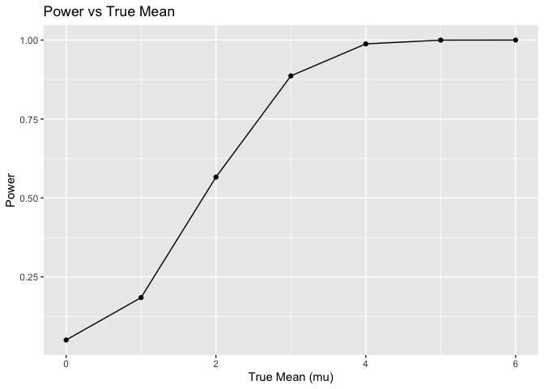
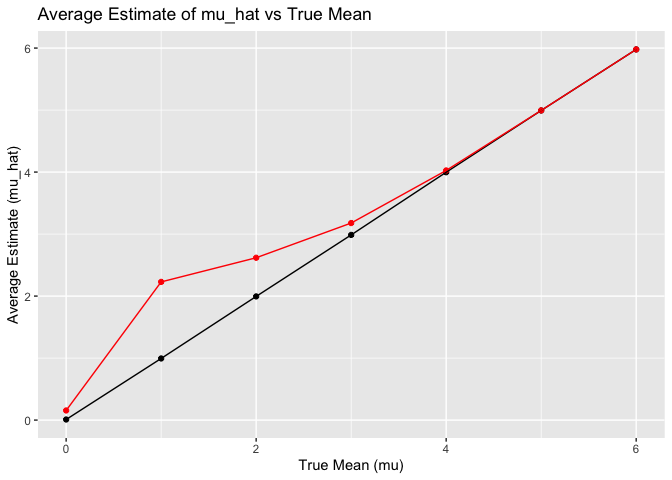

p8105_hw5_qh2283
================
2023-11-15

``` r
library(tidyverse)
```

    ## ── Attaching core tidyverse packages ──────────────────────── tidyverse 2.0.0 ──
    ## ✔ dplyr     1.1.3     ✔ readr     2.1.4
    ## ✔ forcats   1.0.0     ✔ stringr   1.5.0
    ## ✔ ggplot2   3.4.3     ✔ tibble    3.2.1
    ## ✔ lubridate 1.9.2     ✔ tidyr     1.3.0
    ## ✔ purrr     1.0.2     
    ## ── Conflicts ────────────────────────────────────────── tidyverse_conflicts() ──
    ## ✖ dplyr::filter() masks stats::filter()
    ## ✖ dplyr::lag()    masks stats::lag()
    ## ℹ Use the conflicted package (<http://conflicted.r-lib.org/>) to force all conflicts to become errors

``` r
library(purrr)
library(broom)
```

# Problem1

# Problem2

``` r
#Start with a dataframe of all file names
file_names <- list.files(path = "data", full.names = TRUE, pattern = "\\.csv$")
#Read data and extract IDs and arms:
data_list <- map(file_names, ~{
  data <- read_csv(.x)
  file_info <- str_match(.x, "([a-z]+)_([0-9]+)") 
  data <- data %>% 
    mutate(subject_id = file_info[2],
           arm = file_info[1])
})
```

    ## Rows: 1 Columns: 8
    ## ── Column specification ────────────────────────────────────────────────────────
    ## Delimiter: ","
    ## dbl (8): week_1, week_2, week_3, week_4, week_5, week_6, week_7, week_8
    ## 
    ## ℹ Use `spec()` to retrieve the full column specification for this data.
    ## ℹ Specify the column types or set `show_col_types = FALSE` to quiet this message.
    ## Rows: 1 Columns: 8
    ## ── Column specification ────────────────────────────────────────────────────────
    ## Delimiter: ","
    ## dbl (8): week_1, week_2, week_3, week_4, week_5, week_6, week_7, week_8
    ## 
    ## ℹ Use `spec()` to retrieve the full column specification for this data.
    ## ℹ Specify the column types or set `show_col_types = FALSE` to quiet this message.
    ## Rows: 1 Columns: 8
    ## ── Column specification ────────────────────────────────────────────────────────
    ## Delimiter: ","
    ## dbl (8): week_1, week_2, week_3, week_4, week_5, week_6, week_7, week_8
    ## 
    ## ℹ Use `spec()` to retrieve the full column specification for this data.
    ## ℹ Specify the column types or set `show_col_types = FALSE` to quiet this message.
    ## Rows: 1 Columns: 8
    ## ── Column specification ────────────────────────────────────────────────────────
    ## Delimiter: ","
    ## dbl (8): week_1, week_2, week_3, week_4, week_5, week_6, week_7, week_8
    ## 
    ## ℹ Use `spec()` to retrieve the full column specification for this data.
    ## ℹ Specify the column types or set `show_col_types = FALSE` to quiet this message.
    ## Rows: 1 Columns: 8
    ## ── Column specification ────────────────────────────────────────────────────────
    ## Delimiter: ","
    ## dbl (8): week_1, week_2, week_3, week_4, week_5, week_6, week_7, week_8
    ## 
    ## ℹ Use `spec()` to retrieve the full column specification for this data.
    ## ℹ Specify the column types or set `show_col_types = FALSE` to quiet this message.
    ## Rows: 1 Columns: 8
    ## ── Column specification ────────────────────────────────────────────────────────
    ## Delimiter: ","
    ## dbl (8): week_1, week_2, week_3, week_4, week_5, week_6, week_7, week_8
    ## 
    ## ℹ Use `spec()` to retrieve the full column specification for this data.
    ## ℹ Specify the column types or set `show_col_types = FALSE` to quiet this message.
    ## Rows: 1 Columns: 8
    ## ── Column specification ────────────────────────────────────────────────────────
    ## Delimiter: ","
    ## dbl (8): week_1, week_2, week_3, week_4, week_5, week_6, week_7, week_8
    ## 
    ## ℹ Use `spec()` to retrieve the full column specification for this data.
    ## ℹ Specify the column types or set `show_col_types = FALSE` to quiet this message.
    ## Rows: 1 Columns: 8
    ## ── Column specification ────────────────────────────────────────────────────────
    ## Delimiter: ","
    ## dbl (8): week_1, week_2, week_3, week_4, week_5, week_6, week_7, week_8
    ## 
    ## ℹ Use `spec()` to retrieve the full column specification for this data.
    ## ℹ Specify the column types or set `show_col_types = FALSE` to quiet this message.
    ## Rows: 1 Columns: 8
    ## ── Column specification ────────────────────────────────────────────────────────
    ## Delimiter: ","
    ## dbl (8): week_1, week_2, week_3, week_4, week_5, week_6, week_7, week_8
    ## 
    ## ℹ Use `spec()` to retrieve the full column specification for this data.
    ## ℹ Specify the column types or set `show_col_types = FALSE` to quiet this message.
    ## Rows: 1 Columns: 8
    ## ── Column specification ────────────────────────────────────────────────────────
    ## Delimiter: ","
    ## dbl (8): week_1, week_2, week_3, week_4, week_5, week_6, week_7, week_8
    ## 
    ## ℹ Use `spec()` to retrieve the full column specification for this data.
    ## ℹ Specify the column types or set `show_col_types = FALSE` to quiet this message.
    ## Rows: 1 Columns: 8
    ## ── Column specification ────────────────────────────────────────────────────────
    ## Delimiter: ","
    ## dbl (8): week_1, week_2, week_3, week_4, week_5, week_6, week_7, week_8
    ## 
    ## ℹ Use `spec()` to retrieve the full column specification for this data.
    ## ℹ Specify the column types or set `show_col_types = FALSE` to quiet this message.
    ## Rows: 1 Columns: 8
    ## ── Column specification ────────────────────────────────────────────────────────
    ## Delimiter: ","
    ## dbl (8): week_1, week_2, week_3, week_4, week_5, week_6, week_7, week_8
    ## 
    ## ℹ Use `spec()` to retrieve the full column specification for this data.
    ## ℹ Specify the column types or set `show_col_types = FALSE` to quiet this message.
    ## Rows: 1 Columns: 8
    ## ── Column specification ────────────────────────────────────────────────────────
    ## Delimiter: ","
    ## dbl (8): week_1, week_2, week_3, week_4, week_5, week_6, week_7, week_8
    ## 
    ## ℹ Use `spec()` to retrieve the full column specification for this data.
    ## ℹ Specify the column types or set `show_col_types = FALSE` to quiet this message.
    ## Rows: 1 Columns: 8
    ## ── Column specification ────────────────────────────────────────────────────────
    ## Delimiter: ","
    ## dbl (8): week_1, week_2, week_3, week_4, week_5, week_6, week_7, week_8
    ## 
    ## ℹ Use `spec()` to retrieve the full column specification for this data.
    ## ℹ Specify the column types or set `show_col_types = FALSE` to quiet this message.
    ## Rows: 1 Columns: 8
    ## ── Column specification ────────────────────────────────────────────────────────
    ## Delimiter: ","
    ## dbl (8): week_1, week_2, week_3, week_4, week_5, week_6, week_7, week_8
    ## 
    ## ℹ Use `spec()` to retrieve the full column specification for this data.
    ## ℹ Specify the column types or set `show_col_types = FALSE` to quiet this message.
    ## Rows: 1 Columns: 8
    ## ── Column specification ────────────────────────────────────────────────────────
    ## Delimiter: ","
    ## dbl (8): week_1, week_2, week_3, week_4, week_5, week_6, week_7, week_8
    ## 
    ## ℹ Use `spec()` to retrieve the full column specification for this data.
    ## ℹ Specify the column types or set `show_col_types = FALSE` to quiet this message.
    ## Rows: 1 Columns: 8
    ## ── Column specification ────────────────────────────────────────────────────────
    ## Delimiter: ","
    ## dbl (8): week_1, week_2, week_3, week_4, week_5, week_6, week_7, week_8
    ## 
    ## ℹ Use `spec()` to retrieve the full column specification for this data.
    ## ℹ Specify the column types or set `show_col_types = FALSE` to quiet this message.
    ## Rows: 1 Columns: 8
    ## ── Column specification ────────────────────────────────────────────────────────
    ## Delimiter: ","
    ## dbl (8): week_1, week_2, week_3, week_4, week_5, week_6, week_7, week_8
    ## 
    ## ℹ Use `spec()` to retrieve the full column specification for this data.
    ## ℹ Specify the column types or set `show_col_types = FALSE` to quiet this message.
    ## Rows: 1 Columns: 8
    ## ── Column specification ────────────────────────────────────────────────────────
    ## Delimiter: ","
    ## dbl (8): week_1, week_2, week_3, week_4, week_5, week_6, week_7, week_8
    ## 
    ## ℹ Use `spec()` to retrieve the full column specification for this data.
    ## ℹ Specify the column types or set `show_col_types = FALSE` to quiet this message.
    ## Rows: 1 Columns: 8
    ## ── Column specification ────────────────────────────────────────────────────────
    ## Delimiter: ","
    ## dbl (8): week_1, week_2, week_3, week_4, week_5, week_6, week_7, week_8
    ## 
    ## ℹ Use `spec()` to retrieve the full column specification for this data.
    ## ℹ Specify the column types or set `show_col_types = FALSE` to quiet this message.

``` r
#Tidy the data
tidy_data <- map(data_list, ~pivot_longer(.x, cols = -c(subject_id, arm), names_to = "time", values_to = "observation"))
all_data <- bind_rows(tidy_data)

#Spaghetti plot
ggplot(all_data, aes(x = time, y = observation, group = subject_id, color = arm)) +
  geom_line() +
  theme_dark() +
  labs(title = "Observations Over Time by Subject", x = "Time", y = "Observation")
```

<!-- -->
Analyzing the spaghetti plot over an 8-week period reveals variability
in observations for both the control and experimental groups, with the
control group displaying a notably wider spread of data points,
suggesting greater variability. Neither group presents a clear,
consistent trend; rather, observations for individual subjects fluctuate
over time. It is challenging to ascertain definitive differences between
the groups without statistical analysis, as both groups include subjects
with varying observation levels at different times. Moreover, the data
suggest the presence of outliers, particularly in the control group,
where certain subjects’ observations significantly deviate from the rest
at specific times.

``` r
# Problem3

# Set design elements
n <- 30
sigma <- 5
mu_values <- 0:6
alpha <- 0.05
num_simulations <- 5000

# Function to perform simulations
simulate_power <- function(mu, n, sigma, num_simulations, alpha) {
  t_tests <- replicate(num_simulations, {
    sample_data <- rnorm(n, mean = mu, sd = sigma)
    t_test_result <- t.test(sample_data, mu = 0)
    tidy_t_test <- tidy(t_test_result)
    tidy_t_test
  }, simplify = FALSE) %>%
  bind_rows() %>%
  mutate(rejected = p.value < alpha)
  
  data.frame(
    mu = mu,
    power = mean(t_tests$rejected),
    mean_estimate = mean(t_tests$estimate),
    mean_estimate_rejected = mean(t_tests$estimate[t_tests$rejected])
  )
}

# Run simulation for each mu
results <- map_df(mu_values, ~simulate_power(., n, sigma, num_simulations, alpha))

# Plot the power vs true value of mu
ggplot(results, aes(x = mu, y = power)) +
  geom_point() +
  geom_line() +
  labs(title = "Power vs True Mean", x = "True Mean (mu)", y = "Power")
```

<!-- -->
This plot illustrates the power of the test across different true mean
values. Power, which is the probability of correctly rejecting a false
null hypothesis, increases with the true mean. Starting near zero when
the true mean equals the null hypothesis value (μ = 0), the power rises
sharply as the true mean increases, leveling off close to a power of 1.
This suggests that as the effect size (difference from the null
hypothesis) increases, the test becomes more likely to detect a true
effect, indicating a direct relationship between effect size and power.

``` r
# Plot the average estimate of mu_hat
ggplot(results, aes(x = mu, y = mean_estimate)) +
  geom_point() +
  geom_line() +
  labs(title = "Average Estimate of mu_hat vs True Mean", x = "True Mean (mu)", y = "Average Estimate (mu_hat)")
```

<!-- --> The
second plot shows a line (black) that represents the average estimate of
mu hat plotted against the true mean. The relationship appears to be
linear with a slope of approximately 1, indicating that the sample mean
is an unbiased estimate of the true mean; as the true mean increases,
the average estimate of mu hat increases proportionally.

``` r
# Overlay average estimate of mu_hat when null is rejected
ggplot(results, aes(x = mu)) +
  geom_point(aes(y = mean_estimate)) +
  geom_point(aes(y = mean_estimate_rejected), color = "red") +
  geom_line(aes(y = mean_estimate)) +
  geom_line(aes(y = mean_estimate_rejected), color = "red") +
  labs(title = "Average Estimate of mu_hat vs True Mean", x = "True Mean (mu)", y = "Average Estimate (mu_hat)")
```

<!-- --> The
third plot overlays a second line (red), representing the average
estimate of mu hat only in samples where the null hypothesis was
rejected, onto the previous plot. This line generally follows the first
line but deviates slightly at certain points. The closeness of the two
lines suggests that the sample mean remains a good estimate of the true
mean even when the null hypothesis is rejected, albeit with some
discrepancies possibly due to the variability in samples that meet the
rejection criteria.
